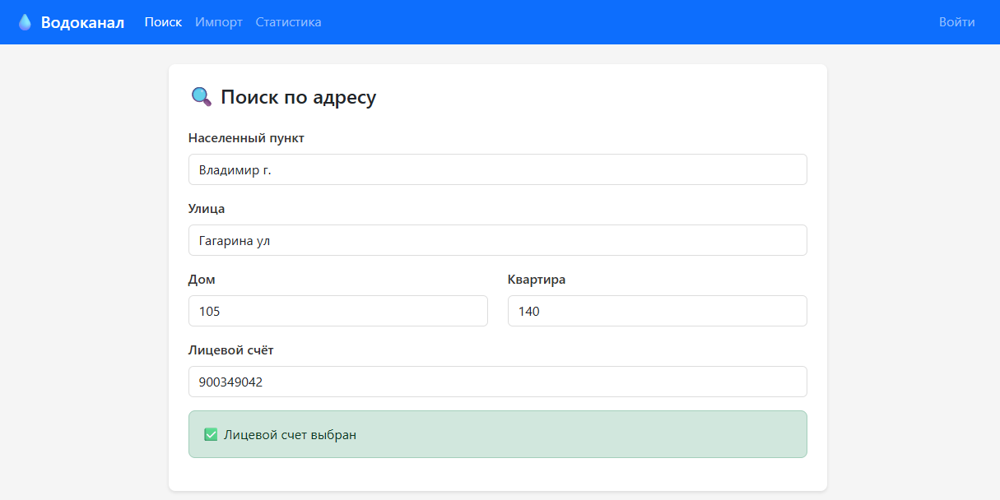

# 💧 Водоканал — Учет начислений

> **Java ETL-приложение** для парсинга, автоматического исправления ошибок и импорта данных о начислениях водоканала в PostgreSQL. Включает **REST API** и **веб-интерфейс** на Angular.

[]()
[]()
[]()
[]()
[]()



---

## 📖 О проекте

---

## 🛠️ Стек технологий

| Слой | Технологии |
|------|------------|
| **Backend** | Java 25, Spring Boot 4.0.5, Spring Security, HikariCP |
| **Frontend** | Angular 21, RxJS 7, Bootstrap 5.3 |
| **Database** | PostgreSQL 18, JDBC |
| **Сборка** | Maven |

---

## ⚙️ Установка и запуск

### 1. Требования
- **Java 25+**
- **Maven 3.8+**
- **PostgreSQL 18**
- **Node.js 20+** и **Angular CLI** (для веб-интерфейса)

### 2. Настройка базы данных
Создайте базу данных и таблицы, выполнив скрипт:
```bash
psql -h localhost -p 5432 -U postgres -f sql/create_database.sql
```

Настройте подключение в `src/main/resources/config.properties`:
```properties
db.host=localhost
db.port=5432
db.name=vodokanal-db
db.user=postgres
db.password=postgres
```

### 3. Запуск Backend (Spring Boot)
```bash
mvn spring-boot:run
```
API доступно по адресу: `http://localhost:8080`

### 4. Запуск Frontend (Angular)
```bash
cd src/main/resources/static
npm install
ng serve --proxy-config proxy.conf.json
```
Веб-интерфейс доступен по адресу: `http://localhost:4200`

### 5. Запуск ETL (Обработка данных)
Поместите файл с данными в корень проекта (указан в `config.properties`) и запустите:
```bash
mvn exec:java -Dexec.mainClass=org.example.Main
```

---

## 🌐 REST API

### Поиск по адресу (Каскадные dropdowns)
| Метод | Endpoint | Описание |
|-------|----------|----------|
| `GET` | `/api/localities?search=` | Список населенных пунктов |
| `GET` | `/api/localities/{id}/streets?search=` | Улицы по НП |
| `GET` | `/api/localities/{id}/streets/{id}/houses?search=` | Дома по улице |
| `GET` | `/api/localities/{id}/streets/{id}/houses/{id}/apartments?search=` | Квартиры по дому |
| `GET` | `/api/apartments/{id}/accounts` | Лицевые счета по квартире |

### Статистика
| Метод | Endpoint | Описание |
|-------|----------|----------|
| `GET` | `/api/statistics` | Сводная статистика по таблицам БД |

> **Авторизация:** Для доступа к API используйте Basic Auth или форму входа (логин: `admin`, пароль: `admin`).

---

## 📊 Формат входных данных

Текстовый файл (`.txt`), разделитель — точка с запятой `;`.
```text
900045955;Иванов И.И.;Владимир г, Ленина ул, 12, 45;519;232.65;3300000001 ХВС;185.0000;
```
**Поля:**
1. Номер ЛС (цифры)
2. ФИО плательщика
3. Адрес (через запятую: НП, Улица, Дом, Квартира)
4. Период начисления
5. Сумма начисления **(обязательное поле)**
6. (Опционально) Пары полей: `Номер прибора; Показания` (могут повторяться)

---

## 📁 Структура проекта

```
vodokanal-parser/
├── src/
│   ├── main/java/org/example/
│   │   ├── Main.java              # Точка входа ETL
│   │   ├── VodokanalApplication.java # Точка входа Web
│   │   ├── config/                # Конфигурация (БД, Security)
│   │   ├── etl/                   # Логика импорта (Batch, Кэш)
│   │   ├── service/parsing/       # Парсер и корректор записей
│   │   └── service/search/        # REST сервисы поиска
│   └── main/resources/static/     # Веб-интерфейс (Angular)
├── sql/                           # Скрипты БД (create, clear)
└── pom.xml
```

---

## 🧪 Тесты

Запуск тестов:
```bash
mvn test
```
В проекте **76 тестов**, покрывающих логику парсинга валидных/невалидных записей и сценарии автоматического исправления ошибок.

---

## 📜 Лицензия

MIT

---
> **Примечание о данных:** Проект предназначен для работы с вымышленными данными. Файл `records.txt` создан программным путем и не содержит реальной персональной информации пользователей.
